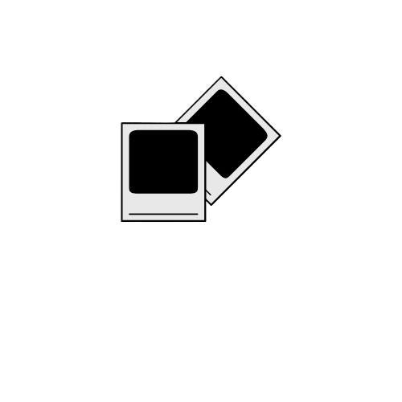

<!-- PROJECT LOGO -->
 

  

<h3 align="center">CraftedPics</h3>

## About The Project

CraftedPics is an AI-powered app that makes decluttering your photo album easy. The app identifies the best photos from your camera roll based on clarity, lighting, and focus. It can also create unique albums based on a user-inputted prompt. After a photo shoot, your photo album can have thousands of poor-quality photos that can take hours to look through just to find a single good one. With CraftedPics, you can find your best photos from any photoshoot within seconds.

Utilizing Google Cloud Vision API, CraftedPics sorts photos into curated albums, organized by your prompts.
